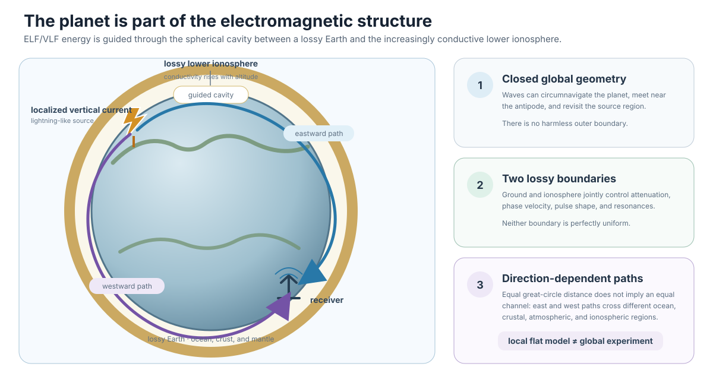
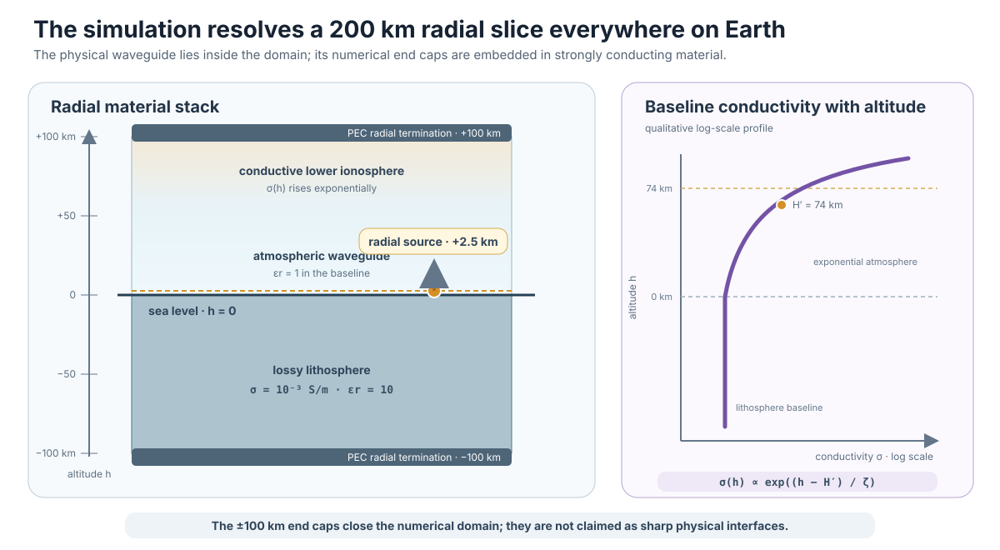
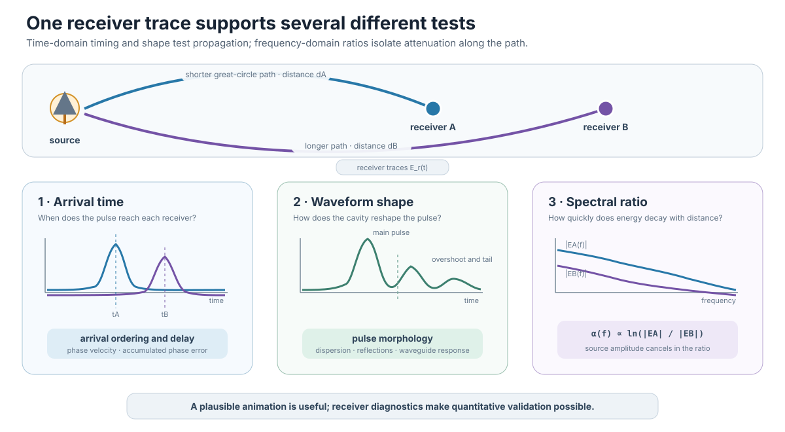
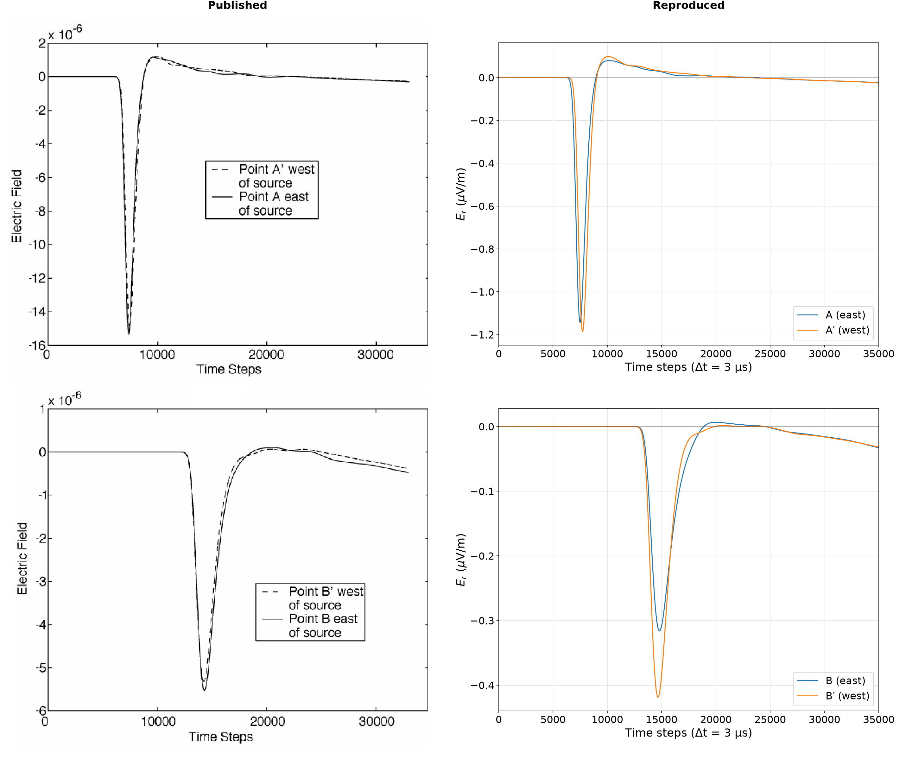
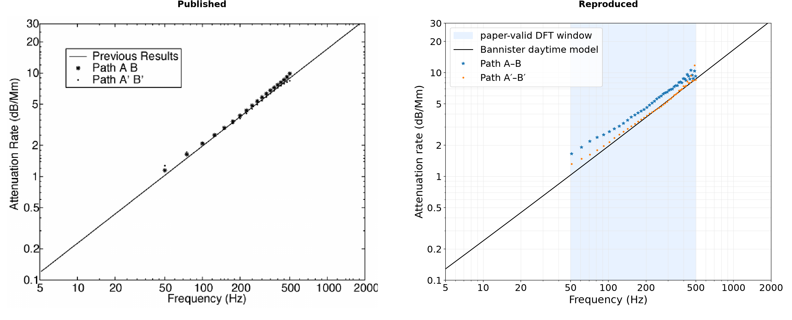

# FDTD on a Planet, Part 1: Why Model the Earth–Ionosphere Waveguide?

Most introductions to finite-difference time-domain methods begin with a box. The geometry is Cartesian, the material is simple, and the source is placed wherever it is convenient. That is a good way to learn the update equations, but it hides the reason this project exists: some electromagnetic systems are intrinsically global.

The space between the conducting Earth and the lower ionosphere forms a spherical electromagnetic waveguide. Extremely low frequency (ELF) and very low frequency (VLF) energy can travel through this cavity for thousands of kilometres, repeatedly interacting with the ground, oceans, atmosphere, and ionosphere. A local flat-Earth model can answer local questions. It cannot naturally represent propagation around the planet, antipodal focusing, or two paths that travel east and west around different crustal and oceanic regions.[^wait-spies][^simpson-taflove-2004]

This series develops a three-dimensional FDTD model designed for that global problem. Before looking at the grid or the implementation, this first article explains what is being modelled, why it matters, and how the numerical experiment in this repository is assembled.

*The waveguide is global, closed, and lossy. Eastward and westward signals can travel the same great-circle distance through different material regions, while waves that continue around the planet can expose accumulated numerical error.*

## The physical system

The ionosphere is the weakly ionized part of the upper atmosphere. Solar radiation and energetic particles create free electrons and ions, making its electrical properties strongly dependent on altitude, local time, latitude, season, and space weather. It is not a perfectly conducting shell with a sharp lower boundary. For ELF propagation, however, its increasing conductivity with altitude creates a lossy upper boundary for the Earth–ionosphere cavity.

The lower boundary is complicated in a different way. Seawater is much more conductive than typical continental crust, and the conductivity below the surface varies with geology and depth. Topography and bathymetry change the effective geometry. Consequently, a signal travelling east from a source does not necessarily experience the same channel as one travelling west, even if both receivers are the same great-circle distance away.

The repository starts from a deliberately data-free material model:

- below sea level, a homogeneous lithosphere with conductivity $10^{-3}\,\mathrm{S/m}$ and relative permittivity 10;
- above sea level, relative permittivity 1 and an exponentially increasing daytime conductivity;
- optional spherical subsurface anomalies whose conductivity and permittivity can differ from the background.

The atmospheric conductivity is

$$
\sigma(h)=2.5\times10^5\epsilon_0
\exp\left(\frac{h-H'}{\zeta}\right),
$$

where the default baseline uses $H'=74\,\mathrm{km}$ and $\zeta=6\,\mathrm{km}$. These parameters are not universal constants. They define a useful baseline that can be replaced without changing the field solver. The verification configuration also provides the sharper daytime profile used in the Simpson–Taflove study, with a 70 km reference height and a 3.33 km scale height.[^bannister-1985][^simpson-taflove-2004]

That separation is important: Maxwell's equations belong in the solver; uncertain geophysical assumptions belong in a material model.

## Why engineers care

At these frequencies, the wavelength is enormous. A 20 Hz free-space wavelength is about 15,000 km. The Earth itself therefore becomes part of the electromagnetic structure.

This regime is relevant to several classes of engineering and scientific problems documented in Earth–ionosphere propagation and global FDTD studies:[^wait-spies][^simpson-heikes-taflove-2006]

- global ELF propagation and the natural resonances of the Earth–ionosphere cavity;
- lightning-generated electromagnetic transients and remote sensing;
- long-range communication and navigation channels;
- assessing how ionospheric conditions alter attenuation, phase velocity, and arrival time;
- studying whether conductivity structures in the crust or upper mantle leave observable signatures;
- testing numerical dispersion and anisotropy on a closed spherical domain.

The final item is as important as the application. A global grid has no harmless outer edge where errors can be hidden behind an absorbing boundary. A wave can circumnavigate the planet and expose accumulated phase error, directional bias, or a broken topological sign convention.

## The experiment represented by the code

The computational domain is a stack of spherical surfaces. By default it extends from 100 km below sea level to 100 km above it. The lower part captures a lossy Earth; the upper part reaches into the increasingly conductive ionosphere. Tangential electric fields are set to zero at the two radial ends. In normal configurations both terminations lie inside strongly conducting regions, rather than being intended as physical interfaces at exactly $\pm100$ km.

*The default source sits just above sea level inside a domain extending from $-100$ to $+100$ km. The numerical end caps lie inside conductive regions; they are not intended to represent sharp physical interfaces at those altitudes.*

The horizontal grid covers the entire globe. It is derived from an icosahedron, recursively subdivided, and projected onto the sphere. Its triangular primal mesh and polygonal dual mesh avoid the polar singularity and extreme cell convergence of a latitude–longitude grid. The construction produces exactly 12 pentagonal dual cells and hexagons everywhere else. Part 2 will explain why this primal–dual pairing is especially useful for integral Maxwell updates.[^randall-2002][^simpson-heikes-taflove-2006]

The default source is a localized vertical Gaussian current above Gwangju, Republic of Korea, at $35.1595^\circ$ N, $126.8526^\circ$ E and 2.5 km altitude. Its peak current, width, centre time, location, and optional carrier frequency are configurable. A modulated 20 Hz experiment uses a frequency-scaled Gaussian envelope unless the width is supplied explicitly.

On a coarse mesh, snapping that source to the nearest grid point would move it by hundreds or thousands of kilometres. The implementation instead finds the containing spherical triangle and distributes current to its three vertices with barycentric weights. In the radial direction, it uses linear cloud-in-cell weights on adjacent staggered planes. The weights preserve the requested current moment, geographic location, and altitude under refinement.

## What we measure

The state consists of four field components arranged on staggered radial planes:

- radial electric field $E_r$;
- tangential electric field $E_t$;
- radial magnetic field $H_r$;
- tangential magnetic field $H_t$.

Experiments can inspect a global surface map, a great-circle distance–height section, or a receiver trace. For validation, receiver traces are particularly valuable. Their arrival times expose phase-velocity error, their shape exposes the interaction between the pulse and the waveguide, and spectral ratios between receivers estimate attenuation without requiring the absolute source amplitude to be known.

*Arrival time tests propagation speed and accumulated phase, pulse morphology reveals dispersion and cavity response, and the spectral ratio between receivers estimates path attenuation while cancelling the unknown absolute source amplitude.*

The project can also render the global field directly on the geodesic mesh. The animation below is a repository-generated example rather than a conceptual illustration.

<iframe
  src="https://www.youtube-nocookie.com/embed/MDfjkfOPYKc"
  title="ELF Waves Around Earth | 3-D Geodesic FDTD Simulation with PyTorch"
  width="960"
  height="540"
  style="width: 100%; aspect-ratio: 16 / 9; border: 0;"
  loading="lazy"
  allow="accelerometer; autoplay; clipboard-write; encrypted-media; gyroscope; picture-in-picture; web-share"
  referrerpolicy="strict-origin-when-cross-origin"
  allowfullscreen>
</iframe>

*[Watch on YouTube: ELF Waves Around Earth | 3-D Geodesic FDTD Simulation with PyTorch](https://www.youtube.com/watch?v=MDfjkfOPYKc).*

The most demanding paper-level validation follows the global ELF experiment of Simpson and Taflove (2004).[^simpson-taflove-2004] The current production comparison uses a complete 35,000-step trace and an ETOPO5-based reconstruction of the paper's unspecified NOAA-NGDC relief input. ETOPO5 is period-appropriate, but the paper does not identify the exact data edition or preprocessing convention, so it cannot be claimed as the authors' original data set.[^verification-2004]

The rerun reproduces the qualitative temporal morphology: a negative main pulse, positive overshoot, persistent slow tail, correct quarter-arc-before-half-arc arrival ordering, and visible east–west nonidentity. It does not reproduce the published east/west peak ordering and separation. It also fails the strict pointwise attenuation tolerances over 50–500 Hz. The A–B path has a mean absolute error of $1.104\,\mathrm{dB/Mm}$ and a maximum error of $2.538\,\mathrm{dB/Mm}$; A′–B′ has a mean absolute error of $0.242\,\mathrm{dB/Mm}$ and a maximum error of $3.258\,\mathrm{dB/Mm}$. This mixed result distinguishes “the waveform looks plausible” from exact plot reproduction and quantitative agreement.[^verification-2004]

## The modelling contract

The current project should be read as a numerical laboratory with explicit assumptions:

1. The geometry is globally spherical and closed.
2. Material loss is represented through conductivity and permittivity sampled at electric-field locations.
3. The baseline ionosphere is isotropic and scalar; magnetized plasma dispersion is not yet part of this solver.
4. The source is an impressed radial current with controlled space–time weighting.
5. Stability is protected by a conservative, geometry-aware Courant estimate.
6. Validation includes convergence and receiver-based comparisons, not only images.

That contract gives us a concrete target for the rest of the series. [Part 2](02-geodesic-grid-and-fdtd-algorithm.md) turns the planet into an oriented geodesic mesh. [Part 3](03-spherical-fdtd-time-stepping.md) places the four fields on that mesh and advances Maxwell's equations. Parts 4 and 5 then express the same algorithm in NumPy and PyTorch before Parts 6–8 build the verification evidence.

## References

[^wait-spies]: J. R. Wait and K. P. Spies, *Characteristics of the Earth-Ionosphere Waveguide for VLF Radio Waves*, NBS Technical Note 300, 1964, [doi:10.6028/NBS.TN.300](https://doi.org/10.6028/NBS.TN.300).

[^simpson-taflove-2004]: J. J. Simpson and A. Taflove, “Three-Dimensional FDTD Modeling of Impulsive ELF Propagation About the Earth-Sphere,” *IEEE Transactions on Antennas and Propagation*, 52(2), 443–451, 2004, [doi:10.1109/TAP.2004.823953](https://doi.org/10.1109/TAP.2004.823953).

[^bannister-1985]: P. R. Bannister, “The Determination of Representative Ionospheric Conductivity Parameters for ELF Propagation in the Earth-Ionosphere Waveguide,” *Radio Science*, 20(4), 977–984, 1985, [doi:10.1029/RS020i004p00977](https://doi.org/10.1029/RS020i004p00977).

[^randall-2002]: D. A. Randall, T. D. Ringler, R. P. Heikes, P. Jones, and J. Baumgardner, “Climate Modeling with Spherical Geodesic Grids,” *Computing in Science & Engineering*, 4(5), 32–41, 2002, [doi:10.1109/MCISE.2002.1032427](https://doi.org/10.1109/MCISE.2002.1032427).

[^simpson-heikes-taflove-2006]: J. J. Simpson, R. P. Heikes, and A. Taflove, “FDTD Modeling of a Novel ELF Radar for Major Oil Deposits Using a Three-Dimensional Geodesic Grid of the Earth-Ionosphere Waveguide,” *IEEE Transactions on Antennas and Propagation*, 54(6), 1734–1741, 2006, [doi:10.1109/TAP.2006.875504](https://doi.org/10.1109/TAP.2006.875504).

[^verification-2004]: Ionosphere FDTD project, “[Simpson–Taflove 2004 Reproduction Verification](../verification/simpson-taflove-2004.md),” accessed 2026-08-14.
