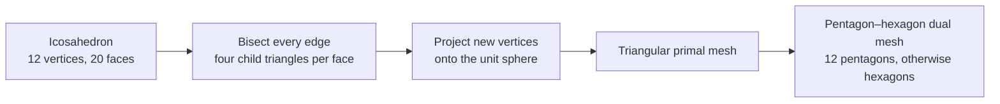
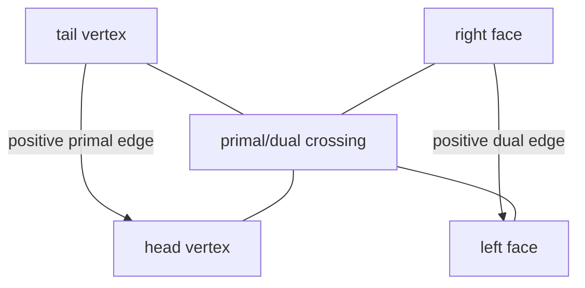
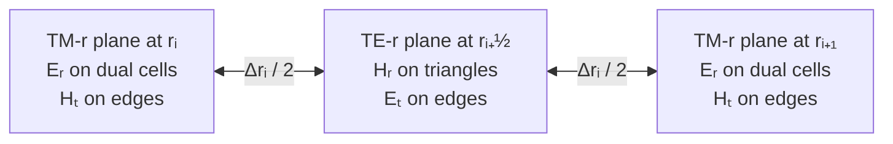
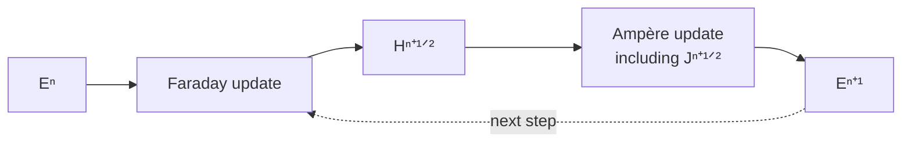

# FDTD on a Planet, Part 2: The Geodesic Grid and the Field Algorithm

A spherical FDTD solver needs more than points distributed over a globe. It needs an oriented topology: edges must have directions, every face must know which way its boundary is traversed, and neighbouring cells must agree on the sign of their shared flux. The metric—lengths and areas—then turns those topological differences and circulations into physical derivatives.

This project builds that structure from an icosahedron and uses it to apply Maxwell's integral laws directly. The result is a staggered three-dimensional method that resembles a Yee scheme, but whose horizontal operators live on a triangular primal mesh and its pentagon–hexagon dual.

## From an icosahedron to a global grid

An icosahedron begins with 12 vertices, 30 edges, and 20 triangular faces. One subdivision step replaces each triangle by four triangles: the three edge midpoints are created, normalized back onto the unit sphere, and connected. Repeating this process produces an increasingly fine geodesic triangulation.

At subdivision level $L$,

$$
N_v=10\cdot4^L+2,\qquad
N_e=30\cdot4^L,\qquad
N_f=20\cdot4^L.
$$

The repository optionally relaxes vertices toward neighbouring face centres and reprojects them onto the sphere, although the default uses no relaxation.

The triangles form the **primal mesh**. A corresponding **dual mesh** is constructed by connecting adjacent triangle centres across each primal edge. A dual cell surrounds every primal vertex. The 12 vertices inherited from the icosahedron have degree five, giving 12 pentagons; all other vertices have degree six, giving hexagons.

The pentagons are not defects accidentally introduced by an implementation. They are topologically necessary. A sphere cannot be tiled entirely by a regular hexagonal network. The 12 degree-five cells supply the curvature needed to close the surface.



## Topology first, metric second

Every primal edge is stored from `tail` to `head`. Once the adjacent faces are known, the positive dual direction is defined from the right face to the left face. This single convention supports four reusable discrete operators:

- `edge_difference`: head minus tail on a primal edge;
- `dual_edge_difference`: left face minus right face across that edge;
- `face_circulation`: signed sum around a triangular primal face;
- `dual_cell_circulation`: signed sum around a pentagonal or hexagonal dual cell.

The signs are purely topological. Physical scale enters through spherical arc lengths and solid angles. On a sphere of radius $r$,

$$
\ell_p=r\theta_p,\qquad
\ell_d=r\theta_d,\qquad
A=r^2\Omega,
$$

where $\theta_p$ and $\theta_d$ are primal and dual central angles and $\Omega$ is a face or dual-cell solid angle. The mesh builder checks that both the primal and dual areas sum to $4\pi$ on the unit sphere. These closure checks catch geometry errors before a time step is taken.

This separation between incidence and metric is one of the design's most useful ideas. Connectivity is built once. The same angular mesh can then be evaluated at every radial plane simply by multiplying by that plane's radius.



## Where the fields live

The three-dimensional domain alternates two types of spherical plane:

- integer-radius **TM-r planes** carry $E_r$ on dual cells (primal vertices) and $H_t$ on edges;
- half-radius **TE-r planes** carry $H_r$ on primal triangles and $E_t$ on edges.

The arrays make this placement explicit:

```text
er[dual_cell, radial_node]
ht[edge,      radial_node]
et[edge,      radial_half_node]
hr[triangle,  radial_half_node]
```

Electric and magnetic fields are also staggered by half a time step. The scheme first advances magnetic fields from the current electric fields, then advances electric fields from the new magnetic fields. This is the familiar leapfrog structure of the Yee algorithm, adapted to spherical primal–dual surfaces.



## The four update equations

In compact mathematical form, one complete update is

$$
\begin{aligned}
H_t^{n+1/2} &= H_t^{n-1/2}
  + \frac{\Delta t}{\mu_0}\left(D_sE_r^n-D_rE_t^n\right), \\
H_r^{n+1/2} &= H_r^{n-1/2}
  - \frac{\Delta t}{\mu_0}C_pE_t^n, \\
E_r^{n+1} &= C_aE_r^n
  + C_b\left(C_dH_t^{n+1/2}-J_r^{n+1/2}\right), \\
E_t^{n+1} &= C_aE_t^n
  + C_b\left(D_dH_r^{n+1/2}-D_rH_t^{n+1/2}\right).
\end{aligned}
$$

Here $D_s$ and $D_d$ are primal and dual surface differences, $D_r$ is a radial difference, and $C_p$ and $C_d$ are primal-face and dual-cell circulation operators.



Each expression is an integral Maxwell update divided by its associated length or area.

### 1. Tangential magnetic field

The surface gradient of $E_r$ is a head-minus-tail difference divided by the primal edge length. The radial derivative of $E_t$ is evaluated between staggered radial locations. Their difference advances $H_t$:

$$
H_t^{n+1/2}=H_t^{n-1/2}
+\frac{\Delta t}{\mu_0}
\left(\nabla_s E_r^n-\partial_r E_t^n\right).
$$

At the two radial ends, the zero tangential-electric boundary is incorporated with a one-sided doubled difference.

### 2. Radial magnetic field

The oriented circulation of $E_t\ell_p$ around each primal triangle is divided by the triangular area. Faraday's law then advances $H_r$:

$$
H_r^{n+1/2}=H_r^{n-1/2}
-\frac{\Delta t}{\mu_0 A_p}
\sum_{e\in\partial p}s_{pe}E_{t,e}^n\ell_{p,e}.
$$

### 3. Radial electric field

Ampère's law uses the circulation of $H_t\ell_d$ around each dual cell. The source enters as radial current density $J_r$: total source current is divided by the cell area at each selected location.

For a conductive material, a trapezoidal treatment of $\sigma E$ gives

$$
C_a=\frac{1-\sigma\Delta t/(2\epsilon)}
{1+\sigma\Delta t/(2\epsilon)},\qquad
C_b=\frac{\Delta t/\epsilon}
{1+\sigma\Delta t/(2\epsilon)}.
$$

The update is

$$
E_r^{n+1}=C_aE_r^n+C_b
\left(\frac{1}{A_d}\sum_{e\in\partial d}s_{de}H_{t,e}^{n+1/2}\ell_{d,e}-J_r^{n+1/2}\right).
$$

Both $C_a$ and $C_b$ are precomputed at every electric-field location, so a heterogeneous lossy model does not add branches to the time loop.

### 4. Tangential electric field

Finally, a left-minus-right difference of $H_r$ across each edge is divided by the dual-edge length. After subtracting the radial difference of $H_t$, the same lossy coefficients advance $E_t$:

$$
E_t^{n+1}=C_aE_t^n+C_b
\left(\nabla_d H_r^{n+1/2}-\partial_r H_t^{n+1/2}\right).
$$

## Nonuniform radial spacing

The surface topology is shared by all layers, but radial nodes do not have to be uniform. Differences of $E_t$ at an interior TM-r plane are divided by the distance between neighbouring radial midpoints. Differences of $H_t$ on a TE-r plane are divided by the corresponding full radial-cell width.

This lets the grid resolve a thin near-surface anomaly with 1.25 km cells while retaining much larger cells far from sea level. It also creates a stability consequence: the smallest radial interval limits the global time step.

## A geometry-aware Courant limit

The implementation estimates a conservative stable step from the smallest primal arc, dual arc, and radial interval:

$$
\Delta t_{\max}=\frac{S}{c_0
\sqrt{\ell_{p,\min}^{-2}+\ell_{d,\min}^{-2}+(2/\Delta r_{\min})^2}},
$$

where $S$ is a user-controlled Courant factor, 0.35 by default. A requested step larger than this estimate is rejected rather than silently producing an unstable run.

This estimate is intentionally conservative. On an irregular grid, quoting only the Cartesian $c\Delta t/\Delta x$ condition would ignore the dual geometry and the radial staggering that actually appear in the update.

## Source injection without grid snapping

The radial-current source is evaluated at the half-time step. Spatially, it is distributed over the three vertices of the containing triangle. Radially, it is split between adjacent $E_r$ planes. If $w_i$ are the combined weights, the injected density at degree of freedom $i$ is

$$
J_{r,i}=\frac{w_i I(t)}{A_{d,i}},\qquad \sum_iw_i=1.
$$

Dividing by the local dual area converts current to current density, while the normalized weights preserve total current. This matters even more as the grid is refined or made nonuniform: a source definition should describe a physical location, not an array index.

## What the algorithm gets right—and what remains

The mesh tests verify closed topology, degree-five/degree-six incidence, orientation, and area closure. Solver tests verify stationary zero fields, finite source-driven fields, material damping, exact source moments, nonuniform radial stepping, and rejection of an unstable time step. Cross-backend tests require NumPy and PyTorch double-precision fields to agree after multiple steps.

The global validation provides a harder test. Waveform morphology and uniform-model convergence are encouraging, and grid-induced directional asymmetry decreases with refinement. At the paper-scale subdivision-7 grid, the measured maximum directional spread stays below 0.295% over the evaluated band. In the heterogeneous production model, ETOPO5 relief and bounded oceanic/continental profiles restore strong physical east–west nonidentity, but the relative peak ordering still differs from the published Figure 7. Strict pointwise attenuation reproduction also fails: the subdivision-8 production maxima are $2.538\,\mathrm{dB/Mm}$ on A–B and $3.258\,\mathrm{dB/Mm}$ on A′–B′. The error budget therefore includes physical-input uncertainty and finite radial and crustal modelling as well as spatial dispersion—not merely floating-point precision.

That is why grid design and validation cannot be separated. A topologically correct update can still be quantitatively under-resolved.

In Part 3, we will translate these operators into NumPy, including the incidence-table technique that makes pentagon and hexagon circulations vectorizable without a Python loop over cells.
