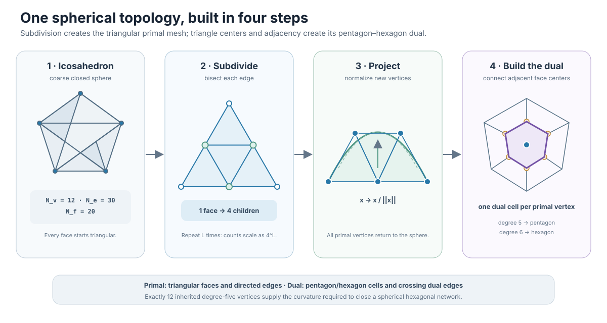
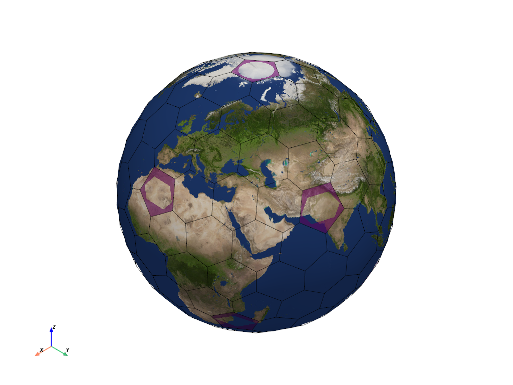
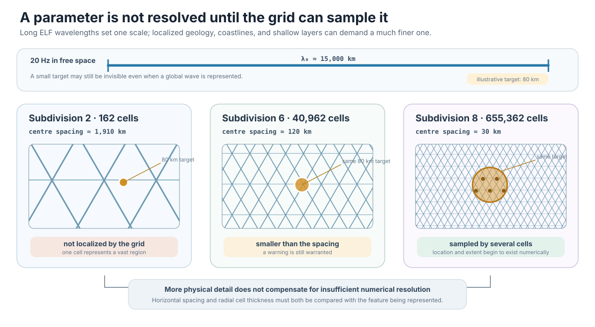
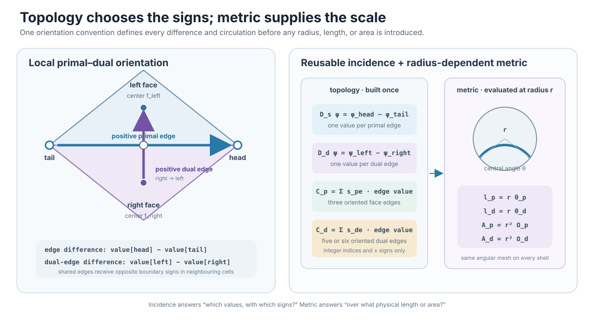

# FDTD on a Planet, Part 2: Building a Spherical Geodesic Grid

[Part 1](01-why-model-the-earth-ionosphere-waveguide.md) treated the space
between the Earth and lower ionosphere as one global spherical waveguide. The
next problem is spatial: how do we turn that continuous sphere into finite
cells without introducing a polar singularity or losing the orientation needed
by Maxwell's curl?

A useful grid needs more than well-distributed points. Every edge must have a
direction, every face must know how its boundary is traversed, and neighboring
cells must use opposite signs on a shared edge. Lengths and areas then convert
those topological differences and circulations into physical derivatives.

## From an icosahedron to a global grid

An icosahedron begins with 12 vertices, 30 edges, and 20 triangular faces. One
subdivision replaces each triangle by four: create its three edge midpoints,
normalize them back onto the unit sphere, and reconnect them. Repetition
produces an increasingly fine triangular geodesic mesh.[^randall-2002]

At subdivision level $L$,

$$
N_v=10\cdot4^L+2,\qquad
N_e=30\cdot4^L,\qquad
N_f=20\cdot4^L.
$$

The repository can relax or optimize vertex positions while preserving the
topology, although the default mesh uses the directly projected coordinates.
[^mesh-source]

*Subdivision and projection create the triangular primal mesh. Connecting
adjacent primal-face centers creates the dual mesh.*

The triangles form the **primal mesh**. Connecting adjacent triangle centers
across each primal edge creates the **dual mesh**, with one dual cell around
every primal vertex. The 12 vertices inherited from the icosahedron have degree
five and produce pentagons; every other vertex has degree six and produces a
hexagon.[^simpson-heikes-taflove-2006]

The pentagons are not implementation defects. They supply the curvature needed
to close a predominantly hexagonal network over a sphere.

*The subdivision-2 grid has 162 dual cells. Purple highlights identify visible
members of the 12 required pentagons.*

## Resolution determines observability

Quartering every triangle makes the surface count grow by a factor of four per
level. Representative scales are:

| Level | Surface cells | Approximate center spacing |
|---:|---:|---:|
| 1 | 42 | 3,765 km |
| 2 | 162 | 1,910 km |
| 3 | 642 | 962 km |
| 6 | 40,962 | about 120 km |
| 7 | 163,842 | about 60 km |
| 8 | 655,362 | about 30 km |

*A 20 Hz free-space wavelength is about 15,000 km, but an 80 km material
feature remains unresolved when cell centers are roughly 120 km apart.*

Wave resolution and material resolution are different requirements. Adding a
detailed anomaly to the input does not make it exist numerically if no electric
degree of freedom resolves its support. The CLI therefore warns when the
chosen horizontal or radial grid cannot observe a requested anomaly.

A laptop smoke run at subdivision 2 is useful for checking setup and
visualization, not for making a quantitatively resolved Earth claim. The paper
studies use subdivisions 7–8, increasing one radial plane from 162 cells to
163,842 or 655,362 cells. That gap is part of the experiment rather than a
mere performance setting.

## Topology first, metric second

Every primal edge is stored from `tail` to `head`. With its adjacent faces
known, the positive dual direction runs from the right face to the left face.
This convention supports four reusable operators:

- `edge_difference`: head minus tail on a primal edge;
- `dual_edge_difference`: left face minus right face across the edge;
- `face_circulation`: oriented sum around a triangular primal face;
- `dual_cell_circulation`: oriented sum around a pentagonal or hexagonal cell.

The signs are topological. Metric scale enters through arc lengths and solid
angles. On a sphere of radius $r$,

$$
\ell_p=r\theta_p,\qquad
\ell_d=r\theta_d,\qquad
A=r^2\Omega,
$$

where $\theta_p$ and $\theta_d$ are central angles and $\Omega$ is a face or
dual-cell solid angle. The same incidence tables can therefore be reused on
every concentric shell while one-dimensional radius factors supply physical
length and area.

*The crossing convention fixes every difference and circulation sign.
Connectivity is stored once; radius-dependent metric factors are applied at
the field's actual shell.*

## Turning curl into finite operations

Faraday's law says that magnetic flux changes according to electric-field
circulation around a surface. Ampère–Maxwell law makes the dual statement for
electric flux, magnetic circulation, and current. On this mesh, a circulation
is a signed edge sum multiplied by edge lengths and divided by the enclosed
area.

For a primal triangular face $p$,

$$
(\nabla\times E)_p
\approx \frac{1}{A_p}
\sum_{e\in\partial p}s_{pe}E_{t,e}\ell_{p,e}.
$$

A dual pentagon or hexagon uses the same expression with five or six boundary
edges. Neighboring cells see a shared edge with opposite signs, which is the
discrete cancellation required by an oriented closed mesh.

The mesh builder checks closed incidence, exactly 12 degree-five vertices, and
both primal and dual area sums against $4\pi$ on the unit sphere. Those checks
catch missing cells, duplicate boundaries, and sign errors before time
integration begins.[^mesh-tests]

The sphere is now an oriented finite operator, but no field has advanced yet.
[Part 3](03-spherical-fdtd-time-stepping.md) stacks these surfaces radially,
places $E_r$, $E_t$, $H_r$, and $H_t$ on staggered degrees of freedom, and
turns the curl operators into one leapfrog time step.

## References

[^randall-2002]: D. A. Randall, T. D. Ringler, R. P. Heikes, P. Jones, and J. Baumgardner, “Climate Modeling with Spherical Geodesic Grids,” *Computing in Science & Engineering*, 4(5), 32–41, 2002, [doi:10.1109/MCISE.2002.1032427](https://doi.org/10.1109/MCISE.2002.1032427).

[^simpson-heikes-taflove-2006]: J. J. Simpson, R. P. Heikes, and A. Taflove, “FDTD Modeling of a Novel ELF Radar for Major Oil Deposits Using a Three-Dimensional Geodesic Grid of the Earth-Ionosphere Waveguide,” *IEEE Transactions on Antennas and Propagation*, 54(6), 1734–1741, 2006, [doi:10.1109/TAP.2006.875504](https://doi.org/10.1109/TAP.2006.875504).

[^mesh-source]: Ionosphere FDTD project, “[Geodesic mesh implementation](../../src/ionosphere_fdtd/mesh.py).”

[^mesh-tests]: Ionosphere FDTD project, “[Geodesic topology and quality tests](../../tests/test_mesh.py).”
