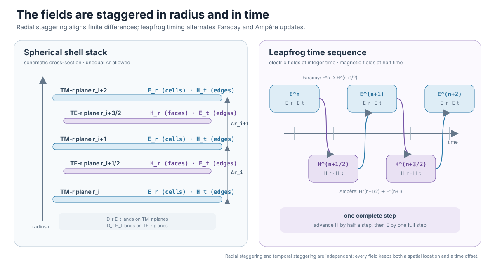
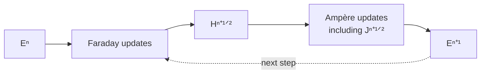
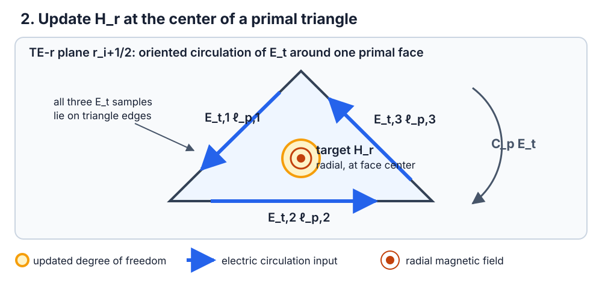
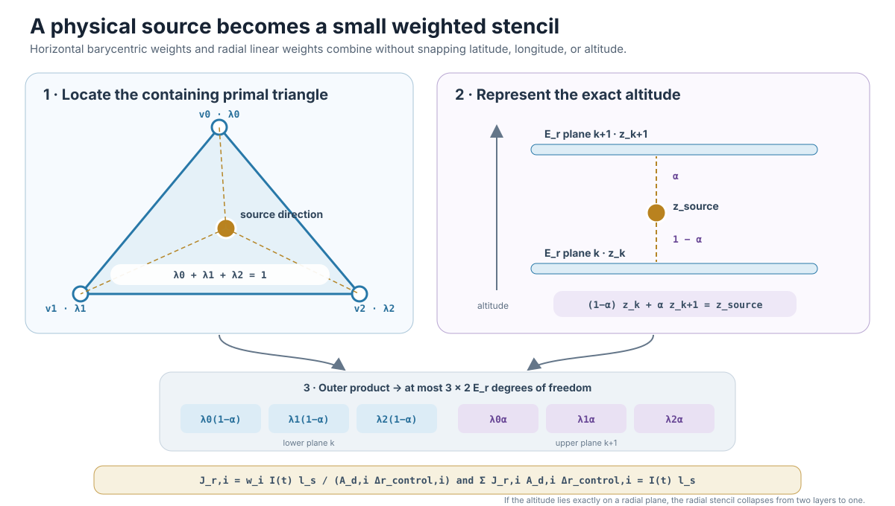

# FDTD on a Planet, Part 3: Advancing Fields on the Spherical Grid

[Part 2](02-geodesic-grid-and-fdtd-algorithm.md) turned the sphere into oriented
primal and dual curl operators. This article adds the remaining dimensions:
radial staggering, leapfrog time, conductive integration, boundaries, and a
source whose physical location does not snap to the nearest grid point.

The central question is where to place four field components and in what order
to update them so that a wave travels through the three-dimensional spherical
shell.

## TM-r and TE-r field placement

The radial direction $r$ separates two alternating spherical planes:

- integer-radius **TM-r planes** carry $E_r$ on dual cells and $H_t$ on edges;
- half-radius **TE-r planes** carry $H_r$ on primal triangles and $E_t$ on
  edges.

The public arrays expose the placement directly:

```text
er[dual_cell, radial_node]
ht[edge,      radial_node]
et[edge,      radial_half_node]
hr[triangle,  radial_half_node]
```



*Space and time are both staggered. Radial midpoint fields make each radial
difference land on the opposite plane type; magnetic half steps let Faraday
and Ampère updates alternate without solving a simultaneous system.*

Electric fields live at integer times and magnetic fields at half times. One
step first advances both magnetic components from the current electric fields,
then advances both electric components from the new magnetic fields. This is
the Yee leapfrog structure on a spherical primal–dual mesh.[^yee-1966]

## One step, four updates

In compact form,

$$
\begin{aligned}
H_t^{n+1/2} &= H_t^{n-1/2}
  + \frac{\Delta t}{\mu_0}\left(D_sE_r^n-D_rE_t^n\right), \\
H_r^{n+1/2} &= H_r^{n-1/2}
  - \frac{\Delta t}{\mu_0}C_pE_t^n, \\
E_r^{n+1} &= C_aE_r^n
  + C_b\left(C_dH_t^{n+1/2}-J_r^{n+1/2}\right), \\
E_t^{n+1} &= C_aE_t^n
  + C_b\left(D_dH_r^{n+1/2}-D_rH_t^{n+1/2}\right).
\end{aligned}
$$

$D_s$ and $D_d$ are primal and dual surface differences, $C_p$ and $C_d$
are surface circulations, and $D_r$ is the staggered radial term. The default
`full-spherical` geometry evaluates

$$
\frac{1}{r}\frac{\partial(rE_t)}{\partial r},\qquad
\frac{1}{r}\frac{\partial(rH_t)}{\partial r}.
$$

The radius-independent `thin-shell` form remains available for reproducing the
paper discretizations.



### 1. Tangential magnetic field

The head-minus-tail difference of $E_r$ supplies the surface gradient. The
spherical radial difference of $E_t$ supplies the other curl term:

$$
H_t^{n+1/2}=H_t^{n-1/2}
+\frac{\Delta t}{\mu_0}
\left(\nabla_sE_r^n-\frac{1}{r}\partial_r(rE_t^n)\right).
$$


Odd tangential-electric ghost values place the PEC trace at zero at both radial
ends and produce the endpoint derivative terms.

### 2. Radial magnetic field

Faraday's law advances $H_r$ from the oriented $E_t$ circulation around a
primal triangle:

$$
H_r^{n+1/2}=H_r^{n-1/2}
-\frac{\Delta t}{\mu_0A_p}
\sum_{e\in\partial p}s_{pe}E_{t,e}^n\ell_{p,e}.
$$



### 3. Radial electric field

Ampère's law advances $E_r$ from the $H_t$ circulation around a pentagonal or
hexagonal dual cell and the collocated radial current density:

$$
E_r^{n+1}=C_aE_r^n+C_b
\left(\frac{1}{A_d}\sum_{e\in\partial d}s_{de}
H_{t,e}^{n+1/2}\ell_{d,e}-J_r^{n+1/2}\right).
$$


For a conductive material, the default exponential midpoint update uses

$$
q=\frac{\sigma\Delta t}{\epsilon},\qquad
C_a=e^{-q},\qquad
C_b=\frac{\Delta t}{\epsilon}\frac{1-e^{-q}}{q},
$$

with $C_b=\Delta t/\epsilon$ at $q=0$. It exactly resolves unforced
conductive decay and remains passive for stiff loss. Paper reproduction selects
the legacy `trapezoidal` coefficients explicitly.

### 4. Tangential electric field

Finally, the left-minus-right difference of adjacent $H_r$ values combines
with the spherical radial difference of $H_t$:

$$
E_t^{n+1}=C_aE_t^n+C_b
\left(\nabla_dH_r^{n+1/2}
-\frac{1}{r}\partial_r(rH_t^{n+1/2})\right).
$$


All metric and material coefficients are prepared before stepping, so a
heterogeneous model does not add material branches inside the time loop.

## Nonuniform radial spacing and stability

Surface connectivity is shared by every shell, but radial nodes may be
nonuniform. Smoothly graded nodes retain the intended radial convergence. An
abrupt factor-four paper subgrid is first-order at its transition and requires
`radial_grid_policy="allow-abrupt"`.

The smallest surface arcs and radial interval set a conservative time scale:

$$
\Delta t=\frac{S\sqrt{\epsilon_{r,\min}}}{c_0
\sqrt{\ell_{p,\min}^{-2}+\ell_{d,\min}^{-2}
+(2/\Delta r_{\min})^2}}.
$$

$S$ is the Courant factor, 0.35 by default. The solver rejects an explicit
`time_step_s` above $S$ times its stored `cfl_time_step_limit_s` rather than
running an unstable configuration.[^solver-source]

## A source that does not snap to the grid

A coarse global grid can move a nearest-node source by hundreds of kilometres.
Instead, the radial current is distributed barycentrically over the three
vertices of its containing spherical triangle and linearly over adjacent radial
planes. Their outer product produces at most six weights $w_i$ with
$\sum_iw_i=1$.[^source-source]



For a vertical current element of length $\ell_s$,

$$
J_{r,i}=\frac{w_iI(t)\ell_s}{A_{d,i}\Delta r_{c,i}},\qquad
\sum_iJ_{r,i}A_{d,i}\Delta r_{c,i}=I(t)\ell_s.
$$

The source therefore denotes a physical position and current moment rather
than an array index, even when the grid changes.

## What the update establishes—and what it does not

Tests cover the zero-field invariant, finite source launch, exact current
moment, conductive decay, nonuniform radial stepping, PEC traces, CFL
rejection, and NumPy/PyTorch agreement.[^solver-tests] The analytic suite later
checks surface modes, lossy propagation, and full-vector spherical cavity
modes. Paper reproductions remain a separate validation question because they
also depend on incompletely specified geophysical inputs.

[Part 4](04-vectorized-fdtd-with-numpy.md) now translates this four-update
algorithm into bulk NumPy operations, including fixed incidence tables that
handle pentagons and hexagons without a Python loop over cells.

## References

[^yee-1966]: K. S. Yee, “Numerical Solution of Initial Boundary Value Problems Involving Maxwell's Equations in Isotropic Media,” *IEEE Transactions on Antennas and Propagation*, 14(3), 302–307, 1966, [doi:10.1109/TAP.1966.1138693](https://doi.org/10.1109/TAP.1966.1138693).

[^solver-source]: Ionosphere FDTD project, “[Spherical field update and stability implementation](../../src/ionosphere_fdtd/solver.py).”

[^source-source]: Ionosphere FDTD project, “[Spatially weighted source implementation](../../src/ionosphere_fdtd/sources.py).”

[^solver-tests]: Ionosphere FDTD project, “[Solver and Maxwell invariant tests](../../tests/test_solver.py).”
