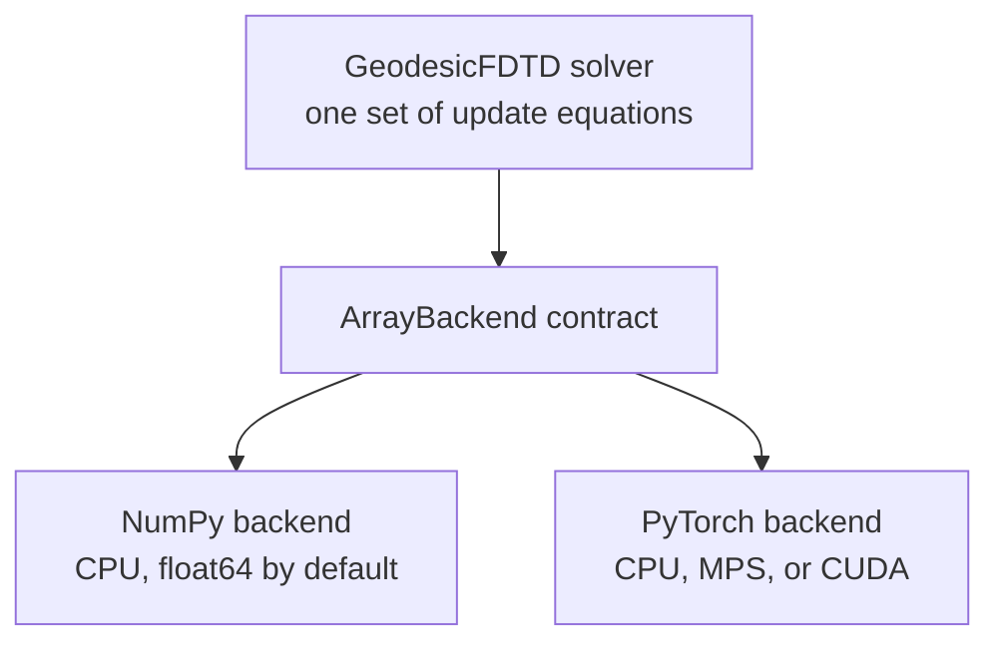
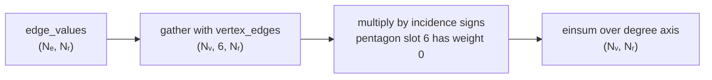
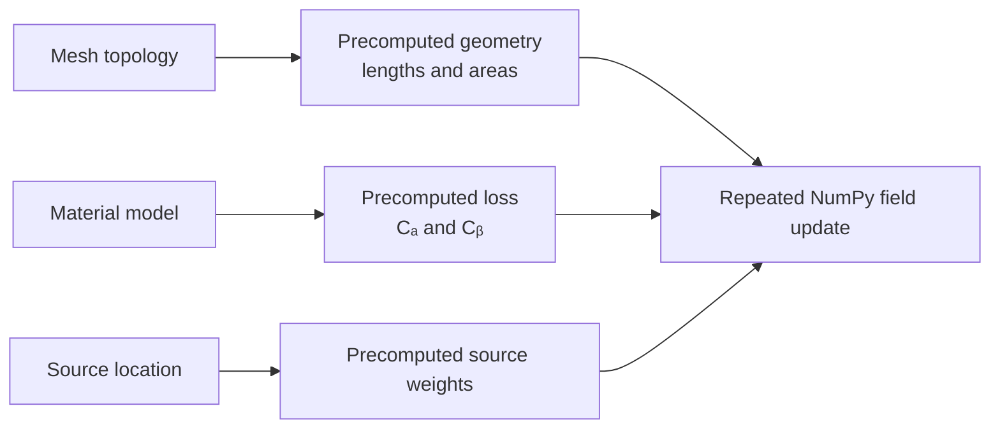

# FDTD on a Planet, Part 3: A Vectorized NumPy Implementation

The mathematical update from Part 2 contains only a few operations: differences, oriented circulations, multiplication by metric terms, and in-place field updates. The implementation challenge is that the arrays are large and the horizontal grid is irregular. A Python loop over every edge, face, cell, radial layer, and time step would bury the algorithm under interpreter overhead.

The NumPy backend solves this by representing the mesh topology as integer arrays and expressing one complete FDTD step as bulk array operations. It is the default backend, the double-precision reference, and the clearest executable description of the numerical method.

## A deliberately small backend contract

The solver does not import NumPy operations throughout its time loop. Instead, it depends on a small `ArrayBackend` interface:

```python
asarray(values)
zeros(shape)
empty_like(values)
diff(values, axis)
edge_difference(vertex_values)
dual_edge_difference(face_values)
face_circulation(edge_values)
dual_cell_circulation(edge_values)
```

There are also conversion, scalar, diagnostic, and memory helpers. Everything specific to NumPy or PyTorch is contained behind this boundary. Geometry preparation and the four field equations are written once in the solver.



NumPy accepts only the CPU device. Its automatic dtype is `float64`, making it a natural reference for correctness and quantitative comparisons.

## Array shape is the data model

For $N_v$ vertices, $N_e$ edges, $N_f$ triangular faces, and $N_r$ radial cells, the state shapes are

```text
Er: (Nv, Nr + 1)
Ht: (Ne, Nr + 1)
Et: (Ne, Nr)
Hr: (Nf, Nr)
```

The first axis is always a surface entity and the second is radial position. This layout lets one indexed topology operation act on every radial layer at once. For example, a surface difference of $E_r$ is simply:

```python
er_head_minus_tail = er[edges[:, 1]] - er[edges[:, 0]]
```

If `er` has shape `(Nv, Nr + 1)`, NumPy advanced indexing returns `(Ne, Nr + 1)`. No explicit radial loop is necessary.

The left-minus-right dual difference is equally direct:

```python
hr_left_minus_right = hr[left_faces] - hr[right_faces]
```

## Vectorizing triangular circulation

Every primal face has exactly three edges. During mesh construction, the code stores:

- `face_edges[face, corner]`, the global edge index;
- `face_edge_signs[face, corner]`, whether the global edge direction agrees with counter-clockwise traversal of that face.

The circulation around all faces is then:

```python
selected = edge_values[face_edges]
circulation = np.sum(selected * face_edge_signs[..., None], axis=1)
```

The real implementation expands the sign dimensions as needed, so the same operator also works for a scalar edge vector or arrays with additional trailing dimensions. With radial field data, `selected` has shape `(Nf, 3, Nr)` and the result has shape `(Nf, Nr)`.

This is a useful pattern for numerical Python: store ragged mathematical relationships in a dense table whenever their maximum arity is small and known.

## Pentagon and hexagon circulation

Dual cells are slightly harder because 12 cells have five incident edges while the rest have six. A straightforward implementation could use `np.add.at` to scatter each signed edge value to its two endpoint cells. That is correct, and the mesh object uses it as a simple reference implementation. Repeated indexed accumulation, however, is not the best inner-loop primitive for this workload.

The NumPy backend therefore builds a padded incidence table once:

```text
vertex_edges:      (Nv, 6)
vertex_edge_signs: (Nv, 6)
```

For a pentagon, the unused sixth slot has sign zero. For a hexagon, all six slots are active. The circulation becomes a gather followed by a contraction:

```python
selected = edge_values[vertex_edges]
flat = selected.reshape(Nv, 6, -1)
result = np.einsum("vdk,vd->vk", flat, vertex_edge_signs, optimize=True)
```

The padded edge index itself can safely contain zero in an unused slot because its corresponding sign is zero. Tests compare this optimized operation with the scatter reference for scalar, one-dimensional, and multidimensional trailing shapes.



## Precompute everything that does not change

An FDTD run may execute tens of thousands of identical-shaped steps. Initialization therefore prepares all static values:

- primal and dual arc lengths at every relevant radius;
- primal-face and dual-cell areas;
- radial cell widths and midpoint distances;
- conductivity and permittivity samples;
- $C_a$ and $C_b$ loss coefficients;
- source vertex, radial-layer, and weight arrays.

The time loop never recomputes spherical distances, material exponentials, or mesh adjacency. It only updates fields and evaluates the scalar source waveform.

This is not merely a performance optimization. It makes the hot loop auditable: every operation in it corresponds to one term of Maxwell's equations.



## One NumPy time step

The magnetic update starts with a vectorized surface derivative:

```python
surface_gradient_er = (
    er[edges[:, 1]] - er[edges[:, 0]]
) / primal_lengths_tm
```

The radial derivative of `Et` is constructed in an array matching `Ht`. Interior nodes use adjacent midpoint differences; endpoints use the zero-tangential-electric boundary. After subtracting that derivative, the array is scaled by `dt / mu0` and added in place to `Ht`.

For `Hr`, edge values are first multiplied by primal edge lengths. `face_circulation` sums the oriented line integral, which is divided by face area and subtracted after scaling by `dt / mu0`.

The electric update gathers `Ht * dual_lengths` with the padded dual incidence operator. The result is divided by dual area. Then:

```python
er *= ca_er
magnetic_circulation *= cb_er
er += magnetic_circulation
```

Source entries are updated through advanced indexing. `Et` follows the same pattern after forming the dual difference of `Hr` and radial difference of `Ht`.

The code uses in-place arithmetic for persistent fields and some temporary arrays. That reduces allocations while keeping the order of the physical update visible.

## Running the reference backend

A minimal Python experiment is:

```python
from ionosphere_fdtd import GeodesicFDTD, GaussianCurrent, SimulationConfig

simulation = GeodesicFDTD(
    SimulationConfig(subdivision=2, radial_cells=24),
    source=GaussianCurrent(carrier_frequency_hz=20.0),
    backend="numpy",
    dtype="float64",
)
simulation.step(1_000)
print(simulation.diagnostics())
```

The public fields are ordinary NumPy arrays, so analysis is direct:

```python
surface_er = simulation.er[:, 12]
peak = np.max(np.abs(surface_er))
```

The command-line equivalent keeps NumPy as the default:

```bash
uv run ionosphere --subdivision 2 --radial-cells 24 --steps 1000
```

## Precision and memory

NumPy defaults to double precision. `float32` is also accepted, but changing precision is a modelling decision, not merely a speed switch. The repository tests compare the PyTorch automatic `float32` result with the NumPy `float64` reference and bound the relative field error for a small run.

Field memory scales linearly with radial resolution and approximately as $4^L$ with subdivision level. Ignoring geometry and material arrays, the number of stored field scalars is

$$
N_v(N_r+1)+N_e(N_r+1)+N_eN_r+N_fN_r.
$$

Double precision uses eight bytes per scalar. At high subdivision, the surface entity count dominates quickly. This scaling explains why a clean CPU reference is essential but not sufficient for the largest verification jobs.

## How correctness is tested

The test suite treats the NumPy implementation as more than a smoke target:

- zero initial fields remain exactly stationary without a source;
- a Gaussian source produces finite nonzero electric and magnetic fields;
- an uncoupled lossy field decays by the precomputed $C_a$ coefficient;
- exact source direction, altitude, and total current are preserved;
- nonuniform radial grids advance without invalid values;
- explicitly unstable time steps are rejected;
- optimized dual circulation matches the simple scatter definition;
- NumPy `float64` and PyTorch CPU `float64` fields agree after 40 steps to tight tolerances.

The last check is particularly valuable. Two independently implemented topology kernels exercise the same solver equations. Agreement helps reveal backend-specific indexing or sign mistakes that a single plausible-looking visualization would miss.

## When NumPy is the right choice

NumPy is an excellent choice for mesh development, equation review, testing, small and medium CPU runs, and post-processing. It has no compilation warm-up, its default precision is conservative, and every array is immediately available to the scientific Python ecosystem.

Its limitation is not expressiveness but scale. At hundreds of thousands of surface cells and tens of thousands of time steps, GPU throughput and compiled tensor graphs become compelling. Part 4 keeps the same solver and replaces only the backend kernels with PyTorch operations suitable for CPU, Apple Metal, and CUDA.
