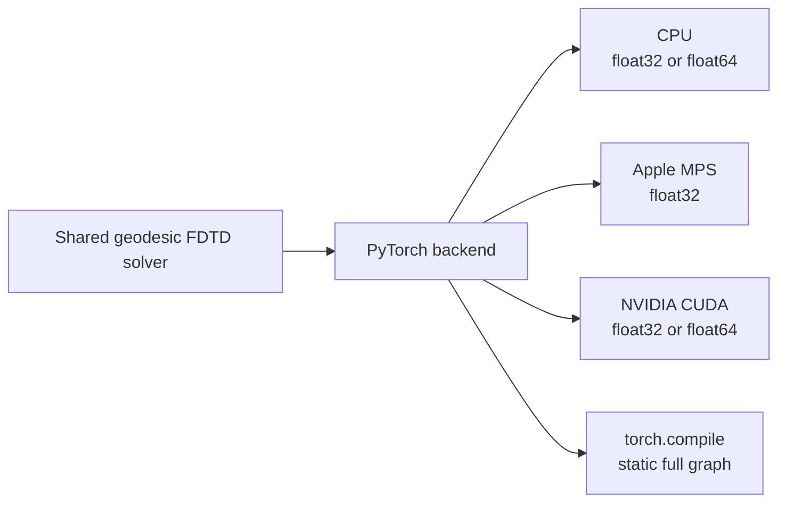
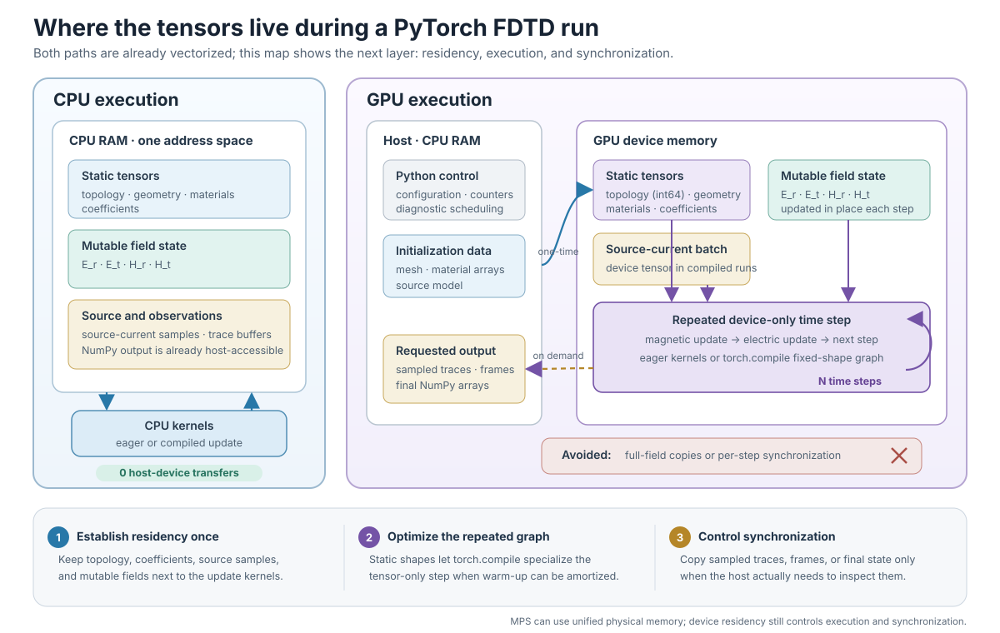
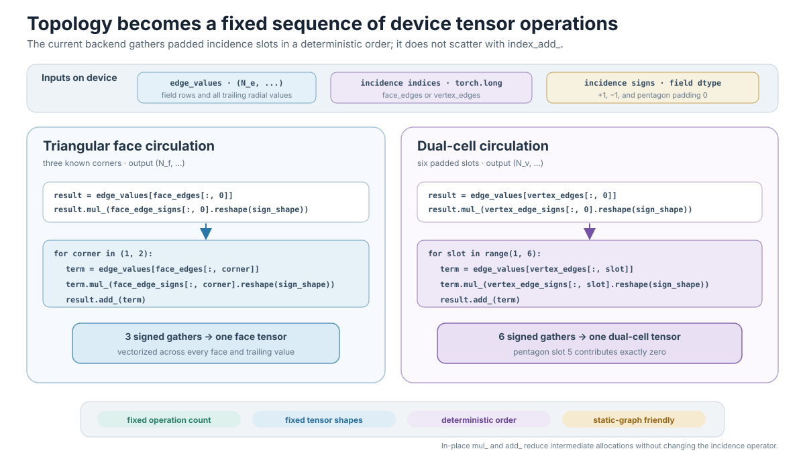
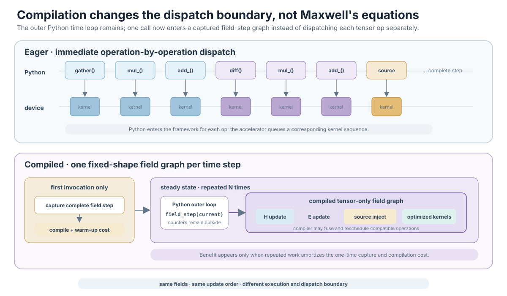
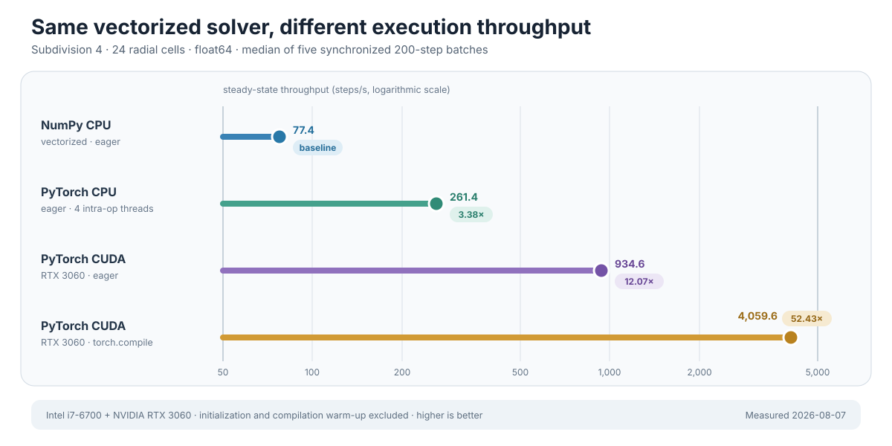
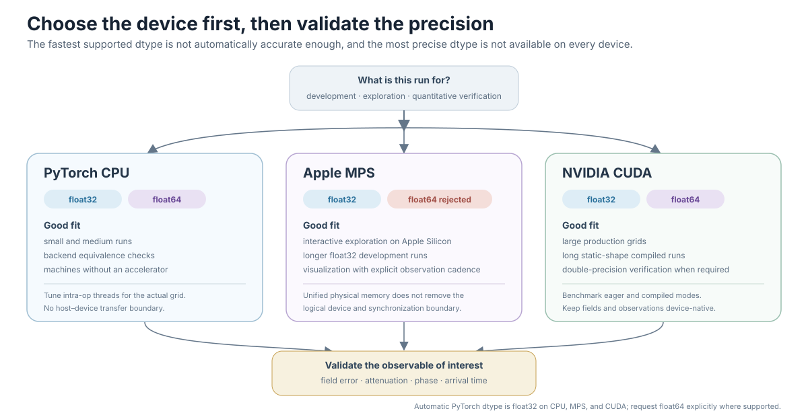
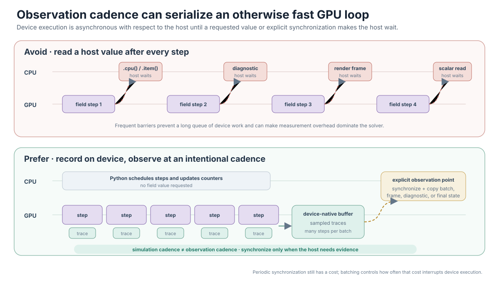

# FDTD on a Planet, Part 5: Accelerating the Solver with PyTorch

The PyTorch version of this project is not a separate FDTD algorithm. It uses the same mesh, field layout, material coefficients, source placement, Courant check, and four update equations as the NumPy version. Only the small set of array and topology operations changes.[^torch-backend-source]

That design gives us two benefits at once: NumPy remains a readable double-precision reference, while PyTorch can run the same time integrator on a multicore CPU, Apple GPU through Metal, or NVIDIA GPU through CUDA. PyTorch documents MPS as its Metal-backed macOS device and CUDA tensors as device-resident operations; static field steps can also be compiled with `torch.compile`.[^pytorch-mps][^pytorch-cuda][^torch-compile]



## Vectorization is the baseline, not the PyTorch optimization

[Part 4](04-vectorized-fdtd-with-numpy.md) removed scalar Python loops by expressing topology gathers, differences, reductions, and field updates as bulk NumPy operations. The PyTorch backend does not replace that idea. It starts from the same tensor-level algorithm and adds a second optimization layer: execution placement and scheduling.

| Question | NumPy vectorization | PyTorch optimization |
|---|---|---|
| What bottleneck does it target? | Python interpreter work inside element-by-element loops | Device transfer, kernel-launch, synchronization, and repeated-graph overhead |
| What changes? | Scalar iterations become array indexing, ufuncs, and reductions | The same bulk operations become device-resident tensors and, optionally, a compiled field-step graph |
| Where does state live? | CPU RAM | CPU RAM, CUDA device memory, or logical MPS device storage |
| What is the optimization boundary? | Usually one eager array operation at a time | Eager tensor kernels, or the complete fixed-shape update with `torch.compile` |
| What costs remain? | Temporary arrays and CPU memory bandwidth | Compilation warm-up, accelerator memory, host–device copies, and synchronization |
| Primary role here | Readable `float64` reference implementation | Scalable execution of the validated algorithm on CPU or accelerator |

The distinction matters because vectorized code is not automatically GPU code, and selecting a GPU does not remove poor data movement. PyTorch acceleration is effective here because the solver is vectorized *before* it reaches the backend, then keeps that bulk work and its persistent state on the execution device.[^pytorch-cuda][^torch-compile]

## Backend selection and device policy

PyTorch support is optional:

```bash
uv sync --extra pytorch
```

The backend accepts `cpu`, `mps`, `cuda`, `cuda:N`, and `gpu` as a CUDA alias. With `device="auto"`, it selects CUDA first, then MPS, then CPU.

```python
simulation = GeodesicFDTD(
    config,
    source=source,
    backend="torch",
    device="auto",
)
```

Device resolution is explicit and defensive. Requesting unavailable MPS or CUDA raises a backend error instead of quietly falling back to CPU. An out-of-range CUDA index is also rejected. This prevents a production command from completing slowly on an unintended device while appearing successful.[^torch-backend-source]

## Tensor placement is established once

At initialization, all floating-point geometry, coefficients, materials, and fields are converted to the requested dtype and device. Edge and face indices become device-resident `torch.long` tensors. During stepping, no mesh data needs to cross the host–device boundary.

The field update receives only a scalar source current tensor. In compiled mode, the solver precomputes the requested sequence of source-current samples as a backend tensor, then selects each sample on the device while invoking the compiled field graph once per time step. Simulation counters and time are updated outside that graph.[^torch-backend-source]

This boundary is intentional: tensor mathematics stays compilable, while Python bookkeeping remains simple.

The memory map below starts after vectorization: both paths already operate on bulk tensors rather than scalar Python loops. It contrasts the next layer, execution placement. On CPU, tensors and kernels share host RAM, so there is no transfer boundary. On a GPU, initialization establishes device residency once; the repeated field update remains on the device, and only requested observations or final outputs cross back to the host.[^pytorch-cuda]



*The optimization is not simply that GPU memory is faster. It comes from keeping static topology and mutable fields next to the kernels for the whole run, compiling the fixed-shape update when the workload can amortize warm-up, and avoiding unnecessary synchronization. MPS may use unified physical memory, but PyTorch still maintains a logical device boundary that controls where operations execute.*

## PyTorch topology kernels

Edge and dual-edge differences look almost identical to NumPy:

```python
vertex_values[edges[:, 1]] - vertex_values[edges[:, 0]]
face_values[left_faces] - face_values[right_faces]
```

Triangular face circulation gathers one edge column at a time, multiplies by its sign in place, and accumulates the next two signed columns with `add_`. Because every primal face has exactly three edges, the operation has a fixed structure that works well in a static graph.

Dual-cell circulation uses the same deterministic padded degree-six incidence table as the current NumPy backend. Each slot gathers a complete tensor, applies its sign with `mul_`, and accumulates with `add_`:[^torch-backend-source]

```python
sign_shape = (n_vertices,) + (1,) * (edge_values.ndim - 1)
result = edge_values[vertex_edges[:, 0]]
result.mul_(vertex_edge_signs[:, 0].reshape(sign_shape))
for slot in range(1, vertex_edges.shape[1]):
    term = edge_values[vertex_edges[:, slot]]
    term.mul_(vertex_edge_signs[:, slot].reshape(sign_shape))
    result.add_(term)
```

Each oriented edge still contributes positively to its tail dual cell and negatively to its head dual cell. The incidence table stores that orientation as signs; a pentagon's unused sixth slot has sign zero. The fixed slot order is bitwise repeatable on CUDA and avoids the order-dependent collisions of an atomic scatter reduction. Cross-backend tests verify the same topological operator through the complete solver.[^backend-tests]



*The loop count is fixed by topology, not by grid size. Each of the three or six iterations operates on every face or vertex and all trailing radial values at once; `torch.compile` can therefore capture a static tensor program.*

## Eager execution and compilation

The eager backend is the simplest way to start:

```bash
uv run --extra pytorch ionosphere \
  --backend torch --device mps --steps 200
```

For a long run with static shapes, compilation can fuse and optimize the tensor-only update:

```bash
uv run --extra pytorch ionosphere \
  --backend torch --device cuda --torch-compile --steps 20000
```

The backend calls:

```python
torch.compile(step, fullgraph=True, dynamic=False)
```

`fullgraph=True` requires the complete field update to be captured and raises an error if a graph break prevents that capture. `dynamic=False` specializes rather than generating dynamic-shape kernels.[^torch-compile] This is a good match for FDTD: geometry is fixed and the same stencil-like operations repeat thousands of times.

Compilation has a warm-up cost. It should not be assumed faster for the 42- or 162-cell development grids. Its value appears when enough work follows the initial compile or when the grid is large enough to amortize dispatch overhead.

The following timeline makes the execution boundary explicit. Eager mode enters PyTorch for each tensor operation. Compiled mode pays capture and compilation cost on its first invocation, then the outer Python time loop calls one compiled field graph per step. Counters and simulation time remain outside that graph.[^torch-backend-source][^solver-source]



*Compilation can fuse or reschedule compatible work, but it does not promise that every operation becomes one kernel. The durable change is the optimization boundary: the compiler sees the complete tensor-only field update.*

## Two measurements with different purposes

The repository now separates a standardized backend matrix from the older
production-oriented throughput experiment below. They answer different
questions and must not be combined into one speedup claim.[^backend-benchmark]

The standardized 2026-08-14 eager `float32` run uses subdivision 2, 16 radial
cells, 20 warm-up steps, and three synchronized 200-step repeats. On its Linux
host, NumPy CPU reached 3022.4 steps/s, PyTorch CPU 1822.5 steps/s, and PyTorch
CUDA 1193.8 steps/s. MPS was unavailable. The deliberately small workload is a
dispatch-overhead test: NumPy wins, and the GPU is slowest.

| Backend | Device | Steps/s | Relative to NumPy |
|---|---|---:|---:|
| NumPy | CPU | 3022.4 | 1.00× |
| PyTorch | CPU | 1822.5 | 0.60× |
| PyTorch | CUDA | 1193.8 | 0.39× |
| PyTorch | MPS | unavailable | — |

The matrix records unavailable devices explicitly, excludes setup and transfer
from the timed region, and synchronizes accelerators before stopping the clock.
It uses `float32` so NumPy, PyTorch CPU, CUDA, and MPS can be compared on hosts
where all four exist. Compiled and `float64` runs are separate experiments.

Run the same eager matrix with:

```bash
python -m benchmarks.backend_matrix \
  --subdivision 2 --radial-cells 16 \
  --steps 200 --warmup-steps 20 --repeats 3 \
  --dtype float32 \
  --output artifacts/benchmarks/backend-matrix-float32.json
```

### A production-oriented historical measurement

A separate 2026-08-07 measurement used a larger polar subdivision-4 mesh (2,562 dual cells, 7,680 edges, and 5,120 triangular faces), 24 radial cells, Courant factor 0.2, a 1 MA Gaussian source, and `float64` fields. After 20 untimed warm-up steps, each result below is the median of five synchronized 200-step batches. Mesh construction, tensor initialization, and the first `torch.compile` capture are excluded, so this is steady-state stepping throughput rather than end-to-end job time.[^backend-throughput-data]

| Implementation | Execution mode | Median steps/s | Speedup vs. NumPy |
|---|---|---:|---:|
| NumPy | CPU, eager | 77.4 | 1.00× |
| PyTorch | CPU, eager, 4 intra-op threads | 261.4 | 3.38× |
| PyTorch | RTX 3060 CUDA, eager | 934.6 | 12.07× |
| PyTorch | RTX 3060 CUDA, compiled | 4,059.6 | 52.43× |



*The horizontal axis is logarithmic so the CPU measurements remain readable beside compiled CUDA. Every multiplier uses the NumPy result as its baseline.*

This historical result separates three effects. Moving from NumPy to eager PyTorch on the same CPU changes the backend kernels and uses four PyTorch intra-op threads. Moving to eager CUDA adds accelerator execution and device residency. Compilation then optimizes the repeated fixed-shape graph. The 52.43× figure is therefore the combined result of backend, hardware, compilation, and this larger workload—not a universal “PyTorch is 52× faster” claim. The standardized small-grid matrix above demonstrates the opposite ordering.

Compilation warm-up is absent from the chart and can dominate short jobs. Small grids can also favor NumPy because framework and launch overhead outweigh useful accelerator work. Backend choice should therefore be based on a benchmark with the intended mesh, radial resolution, dtype, observation cadence, and step count.

## Precision is device-dependent

The automatic PyTorch dtype is `float32` on every device. Explicit `float64` is supported on CPU and CUDA. Apple MPS does not support double precision in this backend and rejects that combination.[^torch-backend-source]

Typical choices are therefore:

```bash
# Fast Apple GPU exploration
uv run --extra pytorch ionosphere \
  --backend torch --device mps --dtype float32 --steps 20000

# Long double-precision CUDA run
uv run --extra pytorch ionosphere \
  --backend torch --device cuda --dtype float64 \
  --torch-compile --steps 35000
```



*Device choice determines available precision and execution policy. Dtype choice still requires an accuracy check against the field, attenuation, phase, or arrival-time quantity that the run is intended to measure.*

Single precision halves field storage relative to double precision and usually improves accelerator throughput. It is not always the dominant source of error, however. In the repository's global validation, a matched CUDA `float64` run changed the early attenuation error negligibly relative to MPS `float32`; correcting the ionospheric profile and spectral window mattered far more. Later production verification still used CUDA double precision so that remaining residuals could not be attributed casually to arithmetic precision.

This is the right way to reason about dtype: test it against the observable of interest rather than assuming either “float32 is enough” or “float64 fixes the physics.” PyTorch likewise cautions that floating-point precision is finite and that mathematically identical operations need not be bitwise identical across execution paths or platforms.[^pytorch-numerical-accuracy]

## CPU thread control

PyTorch CPU uses its process-wide intra-op thread count unless `torch_threads` is supplied. PyTorch's `set_num_threads` API controls CPU intra-op parallelism, and this project exposes it only for the CPU device.[^torch-threads][^torch-backend-source]

```bash
uv run --extra pytorch ionosphere \
  --backend torch --device cpu --torch-threads 1 --steps 20000
```

Small arrays can be faster with one thread because thread-pool overhead exceeds useful parallel work. Larger grids may benefit from more threads. There is no universal setting; benchmark the actual subdivision, radial count, dtype, and machine.

The same warning applies when comparing NumPy CPU, PyTorch CPU, MPS, and CUDA. A tiny default problem measures dispatch and framework overhead at least as much as it measures FDTD throughput.

## Keeping observation off the hot path

The public fields are backend-native tensors. Copying a whole CUDA or MPS field to NumPy at every time step would synchronize the device and destroy much of the benefit of asynchronous execution. PyTorch's CUDA semantics explicitly describe GPU operations as asynchronous and host–device copies as synchronization points unless a supported nonblocking path is requested.[^pytorch-cuda]

The API therefore makes conversion explicit:

```python
er_on_host = simulation.to_numpy(simulation.er)
value = simulation.field_value("er", vertex, layer)
```

Visualization copies tensors to the CPU only when a frame is rendered. Receiver recording can accumulate observations in backend-native storage and synchronize periodically rather than after every scalar sample. Diagnostics synchronize only when values such as a maximum norm are requested.[^solver-source]



*A synchronization point is sometimes necessary; the optimization is to choose its cadence. Traces can stay device-native across many steps, while frames, scalar diagnostics, or final arrays cross to the host only when requested.*

This separation between simulation cadence and observation cadence is a general GPU lesson: an efficient kernel can still be surrounded by an inefficient measurement loop.

## Cross-backend correctness

Acceleration is useful only if it preserves the algorithm. The test suite constructs matched NumPy and PyTorch CPU simulations in `float64`, advances both for 40 source-driven steps, and compares all four fields:

```python
for field in ("er", "et", "hr", "ht"):
    np.testing.assert_allclose(
        torch_simulation.to_numpy(getattr(torch_simulation, field)),
        getattr(numpy_simulation, field),
        rtol=1e-11,
        atol=1e-12,
    )
```

Additional tests cover eager versus compiled execution, automatic device choice, MPS execution when available, CUDA alias handling, dtype restrictions, face circulation, visualization conversion, and configurable CPU thread count.[^backend-tests]

The automatic PyTorch `float32` result is also compared with the NumPy `float64` reference through relative $L_2$ field errors. That is a more meaningful test of a precision mode than checking only for finite numbers.

## What production scale looks like

The authoritative archived production run uses subdivision 8: 655,362 surface cells, 40 radial cells, 35,000 steps, compiled PyTorch on an NVIDIA RTX 3060, and `float64`. It completed in 2,677.5 seconds. A refactored compiled kernel avoided the former 10.1 GB compiled-preflight allocation, so that older memory figure should not be treated as the current production requirement.[^verification-2004]

Those numbers are not universal benchmarks. They document the scale and configuration of one reproducible experiment. Runtime depends on GPU architecture, compiler version, dtype, topology reduction performance, and observation frequency. The more durable conclusion is architectural: a backend-neutral solver allowed the same small tests, physical setup, and validation analysis to move from a NumPy reference to a compiled CUDA production run.

## A complete PyTorch example

```python
from ionosphere_fdtd import GeodesicFDTD, GaussianCurrent, SimulationConfig

simulation = GeodesicFDTD(
    SimulationConfig(subdivision=3, radial_cells=40),
    source=GaussianCurrent(
        latitude_deg=35.1595,
        longitude_deg=126.8526,
        altitude_m=2_500.0,
        carrier_frequency_hz=20.0,
    ),
    backend="torch",
    device="auto",
    dtype="float32",
    compile_step=True,
)

simulation.step(20_000)
simulation.backend.synchronize()
print(simulation.diagnostics())
surface = simulation.to_numpy(simulation.er[:, 20])
```

For a very small grid, start without `compile_step=True`, measure eager execution, and add compilation only when the run is long enough to justify it.

## The broader lesson

GPU acceleration did not require rewriting the geophysical model or maintaining two versions of Maxwell's equations. It required identifying a compact algebra of topology operations, making all persistent state backend-native, keeping transfers explicit, and validating the accelerated path against a simple reference.

That closes the implementation arc of the series:

1. the Earth–ionosphere waveguide defines the physical and engineering problem;
2. the geodesic primal–dual grid turns the sphere into oriented integral operators;
3. spatial and temporal staggering turn those operators into a field step;
4. NumPy provides a vectorized, inspectable reference implementation;
5. PyTorch carries the same algorithm to CPU, MPS, and CUDA at production scale.

The next step is evidence. [Part 6](06-verifying-the-solver-with-analytic-solutions.md) checks A0–A4 analytic Maxwell solutions, while [Parts 7](07-reproducing-simpson-taflove-2004.md) and [8](08-reproducing-simpson-heikes-taflove-2006.md) separate successful physical behavior from the quantitative failures in two paper reproductions.

## References

[^pytorch-mps]: PyTorch Contributors, “[MPS backend](https://docs.pytorch.org/docs/stable/notes/mps.html),” *PyTorch documentation*, accessed 2026-08-06.

[^pytorch-cuda]: PyTorch Contributors, “[CUDA semantics](https://docs.pytorch.org/docs/stable/notes/cuda.html),” *PyTorch documentation*, accessed 2026-08-06.

[^torch-compile]: PyTorch Contributors, “[`torch.compile`](https://docs.pytorch.org/docs/stable/generated/torch.compile.html),” *PyTorch API reference*, accessed 2026-08-06.

[^pytorch-numerical-accuracy]: PyTorch Contributors, “[Numerical accuracy](https://docs.pytorch.org/docs/stable/notes/numerical_accuracy.html),” *PyTorch documentation*, accessed 2026-08-06.

[^torch-threads]: PyTorch Contributors, “[`torch.set_num_threads`](https://docs.pytorch.org/docs/stable/generated/torch.set_num_threads.html),” *PyTorch API reference*, accessed 2026-08-06.

[^torch-backend-source]: Ionosphere FDTD project, “[PyTorch backend implementation](../../src/ionosphere_fdtd/backends/torch_backend.py).”

[^solver-source]: Ionosphere FDTD project, “[Solver time-step and observation implementation](../../src/ionosphere_fdtd/solver.py).”

[^backend-tests]: Ionosphere FDTD project, “[Backend equivalence, device-policy, and compilation tests](../../tests/test_backends.py).”

[^verification-2004]: Ionosphere FDTD project, “[Simpson–Taflove 2004 Reproduction Verification](../verification/simpson-taflove-2004.md),” accessed 2026-08-14.

[^backend-throughput-data]: Ionosphere FDTD project, “[Raw NumPy and PyTorch throughput measurements](data/pytorch-backend-throughput-2026-08-07.csv),” measured 2026-08-07 on an Intel Core i7-6700, NVIDIA GeForce RTX 3060, Python 3.12.3, NumPy 2.5.1, and PyTorch 2.13.0+cu130.

[^backend-benchmark]: Ionosphere FDTD project, “[Backend Performance Comparison](../benchmarks/backend-comparison.md),” reference run dated 2026-08-14.
