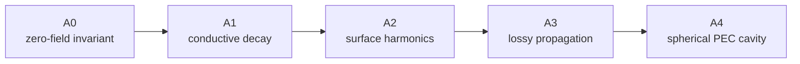

# FDTD on a Planet, Part 5: Verifying the Solver with Analytic Solutions

The first four parts of this series built a geodesic FDTD solver and moved the
same algorithm from NumPy to PyTorch. None of that, by itself, proves that the
program solves Maxwell's equations correctly. A stable animation can hide a
sign error, a wrong metric factor, excessive modal coupling, or a boundary
condition that reflects the wrong field.

This article changes the question from “does the code run?” to “does a known
electromagnetic solution emerge, and does the error decrease at the expected
rate?” The verification suite answers it with five analytic cases, A0 through
A4. They progress from an exact invariant to full-vector eigenmodes in a
concentric spherical cavity.[^analytic-report]



Each rung adds one physical mechanism. When a case fails, that structure
narrows the search: A1 isolates loss integration, A2 exercises geodesic
curl/Hodge operators, A3 combines propagation with attenuation, and A4 tests
the coupled three-dimensional field and radial boundaries.

## Verification is not validation

Verification asks whether the equations were discretized and implemented
correctly. Validation asks whether those equations and their inputs represent
an experiment or the real world closely enough. An analytic solution is
especially valuable for verification because it removes uncertain terrain,
ionosphere, and source data from the comparison.

The five cases use three kinds of evidence:

- exact invariants that must hold to machine precision;
- measured convergence toward a continuum solution as the grid is refined;
- full-field modal projections that expose leakage into unintended modes.

A single fine-grid result is not enough. A plausible small error can be a
coincidence. A consistent second-order slope across several resolutions is much
stronger evidence that the intended discretization controls the error.

## A0: the exact zero-field invariant

With no source and zero initial fields,

$$
\mathbf{E}(\mathbf{x},0)=\mathbf{0},\qquad
\mathbf{H}(\mathbf{x},0)=\mathbf{0},
$$

Maxwell's equations give

$$
\mathbf{E}(\mathbf{x},t)=\mathbf{0},\qquad
\mathbf{H}(\mathbf{x},t)=\mathbf{0}.
$$

This may look trivial, but it touches every update array and both radial
boundaries. A nonzero value would reveal an uninitialized buffer, unintended
source term, bad ghost value, or topology reduction that does not cancel.
Every field remains exactly zero, so A0 passes as a fast default pytest
contract.

## A1: homogeneous conductive relaxation

Next, remove spatial curls but retain material loss. Ampère's law in a
homogeneous isotropic medium becomes

$$
\epsilon\frac{d\mathbf{E}}{dt}+\sigma\mathbf{E}=0,
\qquad \epsilon=\epsilon_0\epsilon_r,
$$

with the analytic solution

$$
\mathbf{E}(t)=\mathbf{E}_0
\exp\!\left(-\frac{\sigma t}{\epsilon}\right).
$$

The characteristic decay time is $\tau=\epsilon/\sigma$. The solver's default
exponential material update reproduces this amplification factor directly. It
also remains passive and finite when conductivity is so high that a
trapezoidal update would retain a sign-alternating stiff mode.

A1 therefore checks more than one sample value. It checks material sampling,
the $C_a$ and $C_b$ coefficients, the zero-conductivity limit, and the
high-conductivity limit without involving geometric derivatives.

## A2: spherical harmonics test the geodesic surface

The natural scalar modes of a sphere are spherical harmonics. On a sphere of
radius $R$,

$$
-\Delta_S Y_\ell^m=\lambda_\ell Y_\ell^m,
\qquad
\lambda_\ell=\frac{\ell(\ell+1)}{R^2}.
$$

For wave speed $c$, the continuum modal frequency is

$$
f_\ell=\frac{c}{2\pi R}\sqrt{\ell(\ell+1)}.
$$

This case is aimed at the horizontal discretization. The sampled harmonic is
advanced through the actual electric and magnetic fields, and its frequency is
measured from the resulting time series. If the spatial operator produces the
discrete eigenvalue $\lambda_h$, centered leapfrog integration predicts the
discrete frequency exactly:

$$
\omega_{h,\Delta t}=\frac{2}{\Delta t}
\sin^{-1}\!\left(\frac{c\Delta t\sqrt{\lambda_h}}{2}\right).
$$

Separating continuum, spatial, and temporal frequencies prevents time-step
dispersion from being mistaken for a mesh error.

Across subdivisions 1–4, the low-TM full-field frequency error falls from
$-1.9382\%$ to $-0.03169\%$. The observed order is $1.9782$, close to the
second-order target. Maximum electric energy outside the intended mode falls
from $0.09570\%$ to $0.003255\%$. A2 therefore passes both the frequency and
modal-purity checks.

## A3: propagation and attenuation together

A1 verifies decay without propagation. A3 asks the electric and magnetic
updates to propagate a wave while dissipating it. For the $e^{+j\omega t}$
convention in a homogeneous medium,

$$
\gamma=\alpha+j\beta
=\sqrt{j\omega\mu\left(\sigma+j\omega\epsilon\right)},
$$

where $\alpha$ is attenuation, $\beta$ is phase constant, and

$$
v_p=\frac{\omega}{\beta}.
$$

At $400\ \mathrm{Hz}$, $\sigma=10^{-3}\ \mathrm{S/m}$, and
$\epsilon_r=10$, the analytic targets are

$$
\alpha=1.25649725\times10^{-3}\ \mathrm{Np/m},
$$

$$
\beta=1.25677689\times10^{-3}\ \mathrm{rad/m},\qquad
v_p=1.99977748\times10^6\ \mathrm{m/s}.
$$

The test uses an auxiliary periodic one-dimensional Yee geometry. That choice
is deliberate: a point source on a sphere introduces geometric spreading and
the geodesic Hodge operator already has its own test in A2. Periodicity leaves
only the material and time-update physics under examination.

From 64 to 512 cells, attenuation and frequency errors converge with orders
$2.0031$ and $2.0024$. A3 passes without borrowing agreement from the spherical
geometry.

## A4: full-vector modes in a spherical PEC cavity

The final case occupies the shell $a<r<b$ between two perfect electric
conductors. Its angular dependence is a vector spherical harmonic, while its
radial factor is

$$
z_\ell(kr)=A j_\ell(kr)+B y_\ell(kr),
$$

where $j_\ell$ and $y_\ell$ are spherical Bessel functions. TE roots satisfy

$$
\det\begin{pmatrix}
j_\ell(ka) & y_\ell(ka)\\
j_\ell(kb) & y_\ell(kb)
\end{pmatrix}=0.
$$

For TM modes, define

$$
D z_\ell(x)=\frac{d}{dx}\left[xz_\ell(x)\right],
$$

and replace each Bessel function in the determinant by its $D$ form. For
$a=6371\ \mathrm{km}$, $b=a+100\ \mathrm{km}$, and $\ell=1$, the first TE
frequency is $1498.99913\ \mathrm{Hz}$; the lowest TM frequency is
$10.50912\ \mathrm{Hz}$.

The initializer samples the analytic vector field at the actual staggered
electric degrees of freedom and begins with $\mathbf{H}=0$. After that, the
ordinary solver advances every component. Nothing is reset or projected back
onto the desired solution. Projection is used only for measurement, so energy
that leaks into another mode remains visible.

The final TE refinement sequence pairs surface subdivisions 2, 3, and 4 with
16, 32, and 64 radial cells. Each run covers five analytic periods.

| Quantity | Coarse | Medium | Fine | Observed order | Result |
|---|---:|---:|---:|---:|---|
| Relative frequency error | $-0.15417\%$ | $-0.03855\%$ | $-0.009638\%$ | 1.99979 | **PASS** |
| Centered-energy variation | $0.07198\%$ | $0.01436\%$ | $0.00009418\%$ | 4.78900 | **PASS** |
| Modal leakage | $0.04121\%$ | $0.04406\%$ | $0.03524\%$ | 0.11302 | **PASS** |
| PEC tangential trace residual | 0 | 0 | 0 | — | **PASS** |

Independent radial TE and TM studies converge with orders 1.9989 and 1.9987.
The odd electric ghost construction places the tangential PEC trace at exactly
zero. A4 closes the gap left by the simpler cases: the coupled full-spherical
curl, radial metric terms, leapfrog timing, and both PEC boundaries work
together at the expected accuracy.

## What the five passes establish

| Case | Evidence |
|---|---|
| A0 | No spurious field is created from zero state |
| A1 | Conductive integration matches exact relaxation |
| A2 | Geodesic surface modes converge at second order |
| A3 | Loss and phase propagation converge together |
| A4 | Full-vector spherical cavity modes and PEC traces converge correctly |

This is strong evidence for the numerical solver under the stated homogeneous
models and boundaries. It is not evidence that a particular ionosphere or
crustal map is correct. The next two articles make that distinction concrete by
attempting to reproduce published Earth–ionosphere simulations. Those tests
are harder precisely because the reference experiments contain physical inputs
that are only partly specified.

## Reproducing the suite

From a current source checkout with verification dependencies installed:

```bash
python -m pytest -q
python -m verification.analytic_solutions --full-field
python -m verification.analytic_solutions --operator-analysis
python -m verification.analytic_solutions --a4-asymptotic
```

Fast deterministic contracts remain in pytest. Resolution studies and
scientific acceptance live under `verification/`; runtime measurements belong
under `benchmarks/` and never decide PASS or FAIL.

## References

[^analytic-report]: Ionosphere FDTD project, “[Analytic Maxwell Solver Verification (A0–A4)](https://github.com/ruddyscent/ionosphere-fdtd/blob/master/docs/verification/analytic-solution-benchmarks.md),” accessed 2026-08-14.

